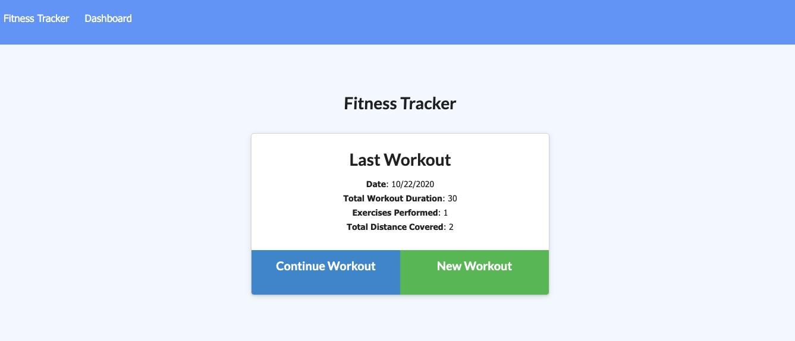
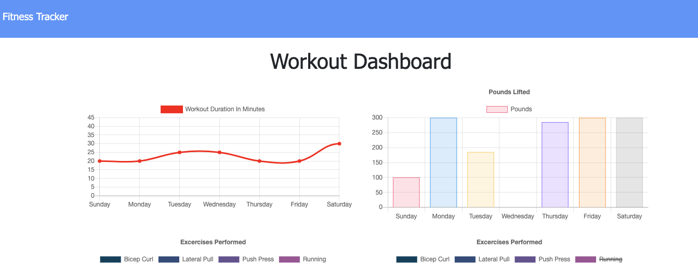

# FitnessTracker
## Description
This workout tracking app was created for those who would like to track their daily workouts. The user is able to log multiple exercises in a workout on a given day and track the name, type, weight, sets, reps, and duration of the exercise. For cardio exercise, the user is able to track the distance traveled. The application uses Express, Mongoose, and Mongojs npm packages.
Use the following link to view the app: https://fitnesstracker0.herokuapp.com/

## License

## Images

